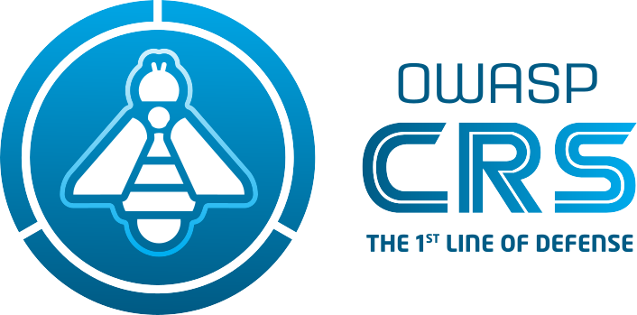

---

layout: col-sidebar
title: OWASP CRS
tags: crs
level: 4
type: code
pitch: The OWASP CRS is a set of generic attack detection rules for use with ModSecurity or compatible web application firewalls. The CRS aims to protect web applications from a wide range of attacks, including the OWASP Top Ten, with a minimum of false alerts.

---
<!-- build -->
**The 1st Line of Defense Against Web Application Attacks**

The OWASP CRS is a set of generic attack detection rules for use with [ModSecurity](https://modsecurity.org/) or compatible web application firewalls. It aims to protect web applications from a wide range of attacks, including the [OWASP Top Ten](https://owasp.org/www-project-top-ten/), with a minimum of false alerts. CRS provides protection against many common attack categories, including SQL Injection, Cross Site Scripting, Local File Inclusion, etc. 

The official website of the project can be found at [https://coreruleset.org](https://coreruleset.org).

## Getting Started / Tutorials

To install CRS, you need first to [select your engine](https://coreruleset.org/docs/deployment/engine_integration_options/), and then [install the rules](https://coreruleset.org/docs/deployment/install/).

## Licensing

OWASP CRS is free to use. It is licensed under the [Apache Software License version 2 (ASLv2)](https://www.apache.org/licenses/LICENSE-2.0), so you can copy, distribute and transmit the work, and you can adapt it, and use it commercially, but all provided that you attribute the work and if you alter, transform, or build upon this work, you may distribute the resulting work only under the same or similar license to this one. 

## Reporting Issues

* If you think you've found a false positive in commercially available software and want us to take a look, [submit an issue here](https://github.com/coreruleset/coreruleset/issues/new/choose) on our Github
* Have you found a false negative/bypass? See our [policy](https://github.com/coreruleset/coreruleset/security/policy) first on how to contact us.

## Logos

You can find the project logos in the [OWASP Swag repository](https://github.com/OWASP/owasp-swag/tree/master/projects/crs).

## Sponsors

### Project Gold Sponsors



### Project Silver Sponsors


