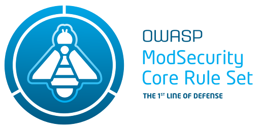

---

layout: col-sidebar
title: OWASP ModSecurity Core Rule Set
tags: crs
level: 4
type: code

---
<!-- build -->
**The 1st Line of Defense Against Web Application Attacks**

The OWASP ModSecurity Core Rule Set (CRS) is a set of generic attack detection rules for use with [ModSecurity](https://modsecurity.org/) or compatible web application firewalls. The CRS aims to protect web applications from a wide range of attacks, including the [OWASP Top Ten](https://owasp.org/www-project-top-ten/), with a minimum of false alerts. The CRS provides protection against many common attack categories, including SQL Injection, Cross Site Scripting, Local File Inclusion, etc. 

The official website of the project can be found at [https://coreruleset.org](https://coreruleset.org).

## Getting Started / Tutorials

The following tutorials will get you started with ModSecurity and the CRS v3.

* [Installing ModSecurity](https://www.netnea.com/cms/apache-tutorial-6_embedding-modsecurity/)
* [Including the OWASP ModSecurity Core Rule Set](https://www.netnea.com/cms/apache-tutorial-7_including-modsecurity-core-rules/)
* [Handling False Positives with the OWASP ModSecurity Core Rule Set](https://www.netnea.com/cms/apache-tutorial-8_handling-false-positives-modsecurity-core-rule-set/)

These tutorials are part of a big series of Apache/ModSecurity guides published by [netnea](https://www.netnea.com/cms/apache-tutorials). They are written by Christian Folini.

More Information about the rule set is available at the [official website](https://coreruleset.org). 

## Licensing

OWASP ModSecurity CRS is free to use. It is licensed under the [Apache Software License version 2 (ASLv2)](https://www.apache.org/licenses/LICENSE-2.0), so you can copy, distribute and transmit the work, and you can adapt it, and use it commercially, but all provided that you attribute the work and if you alter, transform, or build upon this work, you may distribute the resulting work only under the same or similar license to this one. 

## Reporting Issues

* If you think you've found a false positive in commercially available software and want us to take a look, [submit an issue here](https://github.com/coreruleset/coreruleset/issues/new/choose) on our Github
* Have you found a false negative/bypass? See our [policy](https://github.com/coreruleset/coreruleset/security/policy) first on how to contact us.

## Logos

You can find the project logos in the [OWASP Swag repository](https://github.com/OWASP/owasp-swag/tree/master/projects/coreruleset).

## Project Sponsors


